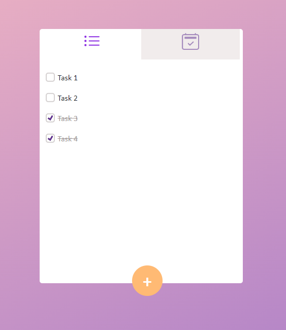

# ToDo List  
### ToDo list is a simple web application to save your daily tasks in order not to miss anything.   

## Features  
Add new task in list   
Remove or Delete single list   
Mark task as completed / uncompleted   
Delete task   

## Screenshot

## Technologies   
React JS (Hooks)   
Redux   
Firebase ReatTime Database   

### Firebae RealTime DataBase Configuration 
Keep the configurations for the Firebase RealTime Database in the .env file as follows

REACT_APP_API_KEY= `<API KEY>`  
REACT_APP_AUTH_DOMAIN= `<AUTH DOMAIN>`  
REACT_APP_PROJECT_ID= `<PROJECT ID>`  
REACT_APP_STORAGE_BUCKET=`<STORAGE BUCKET>`  
REACT_APP_MESSAGING_SENDER_ID=`<MESSAGING SENDER ID>`  
REACT_APP_APP_ID=`<APP ID>`  
REACT_APP_MEASUREMENT_ID=`<MEASUREMENT ID>`  

## Start Project   
git clone git@github.com:rokansikder/react-todo-list.git   
cd react-todo-list   

### `npm start`   
Runs the app in the development mode.   
Open http://localhost:3000 to view it in the browser.   

The page will reload if you make edits.   
You will also see any lint errors in the console.   

### `npm test`   
Launches the test runner in the interactive watch mode.   

### `npm run build`   
Builds the app for production to the build folder.   
It correctly bundles React in production mode and optimizes the build for the best performance.   
